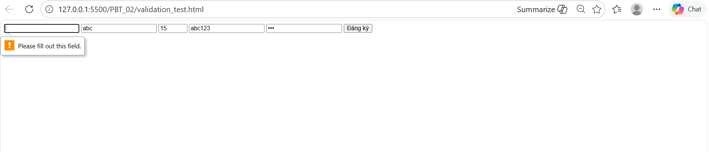
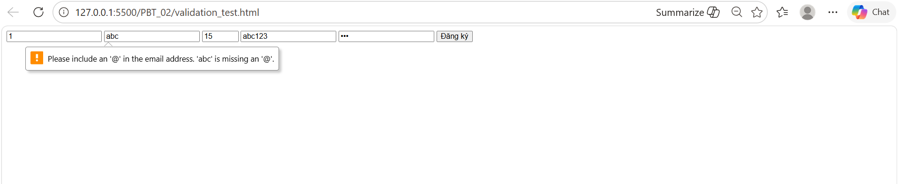
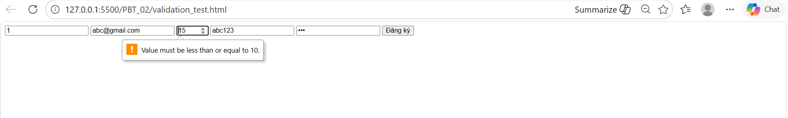
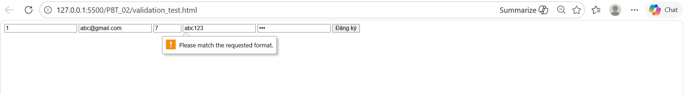
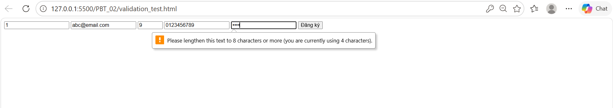

Phần A:  
Câu A1 - Input Types (tuan_1_html5/07_forms_interactive.md + mục 3)  
10 input types khác nhau trong HTML5:  
1. type="text" -> Ô nhập text, giới hạn độ dài, kiểm tra nhập đúng định dạng (pattern) -> Dùng cho form đăng ký, đăng nhập
2. type="email" → Ô nhập text, tự kiểm tra có @ → Dùng cho form đăng ký
3. type="password" -> Các ký tự nhập vào được ẩn đi giới hạn độ dài (minlength), kiểm tra nhập đúng định dạng (pattern) -> Dùng cho ô nhập mật khẩu đăng nhập hoặc xác nhận thanh toán
4. type="number" -> Ô nhập có kèm nút chọn tăng/giảm, giới hạn giá trị (min/max), khoảng cách giá trị (step) -> Dùng để chọn số lượng sản phẩm muốn mua trong giỏ hàng
5. type="tel" -> Bàn phím số trên mobile -> Dùng để nhập sôd điện thoại
6. type="date" -> Bảng chọn lịch, giới hạn giá trị -> Dùng cho khách hàng nhập ngày sinh
7. type="time" -> Bảng chọn giờ/phút, giới hạn giá trị -> Dùng để khách hàng chọn khung giờ giao hàng
8. type="color" -> Bảng chọn màu khi click một ô hiển thị màu -> Dùng trong trang quản trị để tùy chỉnh màu sắc giao diện cửa hàng hoặc nhãn dán sản phẩm
9. type="range" -> Một thanh trượt để chọn giá trị trong một khoảng định sẵn, giới hạn giá trị -> Dùng trong bộ lọc tìm kiếm để chọn khoảng giá sản phẩm
10. type="file" -> Cửa sổ duyệt file trên thiết bị, giới hạn định dạng (accept) và số lượng (multiple) ->  Khách hàng tải ảnh hoặc video thực tế khi viết đánh giá (review) sản phẩm  

Câu A2 - Validation Attributes (tuan_1_html5/07_forms_interactive.md + mục 3)  
- TH1: 
```html<input type="text" required value="">```
-> Ô nhập màu đỏ hoặc màn hình hiện dòng cảnh báo vì có required  
- TH2:
```html<input type="email" value="abc">```
-> Màn hình hiện thông báo nhập sai định dạng email vì type="email" tự động kiểm tra định dạng  
- TH3:
```html<input type="number" min="1" max="10" value="15">```
-> Màn hình hiện thông báo nhập giá trị quá lớn so với giới hạn vì max="10"  
- TH4:
```html<input type="text" pattern="[0-9]{10}" value="abc123">```
-> Màn hình hiện thông báo nhập sai định dạng vì pattern yêu cầu nhập đủ 10 số 0->9
- TH5:
```html<input type="password" minlength="8" value="123">```
-> Màn hình hiện thông báo nhập giá trị quá ngắn vì minlength="8"
KẾT QUẢ:
- TH1:


- TH2:


- TH3:


- TH4:


- TH5:
  

Dự đoán vs Thực tế:  
Trường hợp	        | Thuộc tính gây lỗi    | Validity State (Thực tế)  | Trạng thái :invalid |
| :---        | :---                | :---                  | :---      | 
 Để trống	    | required	          | valueMissing: true    | có        |
 Gõ "abc"     | type="email"        | typeMismatch: true    | có        |
 Gõ "15"	    | min="1" max="10"    | rangeOverflow: true   | có        |
 Gõ "abc123"  | pattern="[0-9]{10}" | patternMismatch: true | có        |
 Gõ "123"     | minlength="8"       | tooShort: true        | có        |

Câu A3 - Accessibility (tuan_1_html5/07_forms_interactive.md + mục 3)  
1.  `<label for="email">` quan trọng cho người dùng screen reader vì screen reader sẽ thông báo cho người dùng biết họ cần nhập dữ liệu gì vào ô này  
2. Dùng `<fieldset`> + `<legend>` để nhóm các dữ liệu đầu vào có liên quan với nhau
VD:  
```html
<fieldset class="account">
  <legend>Tài khoản</legend>
  <label for="username">Username:</label>
  <input type="text"
  name="username" 
  id="username"
  placeholder="Tên tài khoản"
  pattern="(?=.*\d)(?=.*[a-z])(?=.*[A-Z]).{3,20}">
  <label for="password">Password:</label>
  <input type="password" 
  name="password" 
  id="password"
  pattern="(?=.*\d)(?=.*[A-Z]).+"
  minlength="8"
  placeholder="Mật khẩu">
</fieldset>
```
3.  
- aria-label dùng khi muốn cung cấp thông tin mô tả cho các thiết bị hỗ trợ (screen reader)
- KHÔNG nên dùng aria-label khi đã có `<label>` vì screen reader sẽ đọc bị lặp nội dung mô tả

Câu A4 - Media (tuan_1_html5/06_graphics_multimedia.md + mục 3)  
1. Thuộc tính loading="lazy" trên thẻ ``. 
- Cải thiện tốc độ tải của trang web
- Không nên dùng cho những hình ảnh xuất hiện khi vừa mở trang đã thấy
2. 
- Nên cung cấp nhiều `<source>` trong thẻ `<video>` vì browser chọn ra cái phù hợp với thiết bị của người dùng  
- 3 format video web phổ biến:
+ ```html<source src="review.webm" type="video/webm"> ```
+ ```html<source src="review.mp4" type="video/mp4">```
+ ```html<source src="movie.ogv" type="video/ogg">```
3. 
- Thuộc tính alt trên `` dùng để mô tả hình ảnh khi ảnh bị lỗi hoặc giúp trình đọc màn hình hiểu nội dung hình ảnh
- alt tốt cho 3 trường hợp:
+ Ảnh sản phẩm iPhone 16 -> alt="iPhone 16 Pro Max 265GB màu Titan"
+ Ảnh trang trí (decorative) -> alt=""
+ Ảnh biểu đồ doanh thu Q1/2026 -> alt="Biểu đồ đường hiển thị doanh thu quý 1 năm 2026 có xu hướng tăng"  

Câu A5 - So sánh `<figure>` vs `` (tuan_1_html5/06_graphics_multimedia.md + mục 3)  
- Dùng Cách 1 khi ảnh chỉ mang tính chất trang trí hoặc minh họa nhỏ lẻ không cần chú thích
- Dùng Cách 2 khi ảnh là một phần quan trọng của nội dung bài viết và cần có tiêu đề hoặc chú thích bên dưới  
2 ví dụ thực tế cho mỗi cách:  
Cách 1:  
VD 1: Logo thương hiệu trên thanh điều hướng  
```html
<a href="index.html">
  
</a>
```  
VD 2: Icon chức năng trong giỏ hàng  
```html
<button>
   
  Thêm vào giỏ hàng
</button>
```  
Cách 2:  
VD 1: Chi tiết sản phẩm thời trang  
```html
<figure>
    
    <figcaption>Hình 1: Chất liệu vải cotton thoáng mát, phù hợp cho mùa hè.</figcaption>
</figure> 
```   
VD 2: Biểu đồ trong báo cáo hệ thống  
```html
<figure style="text-align: center;">
    
    <figcaption>Biểu đồ 2.1: Các tương tác chính của thủ thư và sinh viên với hệ thống.</figcaption>
</figure> 
```    
Phần B:  
Câu B1 - Form Đăng ký Tài khoản (tuan_1_html5/07_forms_interactive.md + mục 3)  
HTML không thể validate confirm password vì các thuộc tính như required, minlength, hay pattern của HTML chỉ có thể kiểm tra dữ liệu của chính ô đó dựa trên một quy tắc cố định nên không kiểm tra được "Sự trùng khớp".

Phần C:  
Câu C1 - Debug Form (tuan_1_html5/07_forms_interactive.md + mục 3)  
Lỗi 1: Dòng 2 — Input "Tên" không có `<label for="...">`, vi phạm accessibility  
Sửa:  
```html
<label for="name">Tên:</label>
<input type="text" id="name" name="name" required>
```  
Lỗi 2: Dòng 4 — Input "Email" không có `<label for="...">`, vi phạm accessibility  
Sửa:  
```html
<label for="email">Email:</label>
<input type="email" 
id="email" 
name="email" 
placeholder="Email của bạn" 
required>
```  
Lỗi 3: Dòng 6 — Input "Mật khẩu" không có `<label for="...">`, vi phạm accessibility  
Sửa:  
```html
<label for="password">Mật khẩu:</label>
<input type="password" 
id="password" 
name="password"
placeholder="Mật khẩu" 
required>
```  
Lỗi 4: Dòng 7 — Input "Nhập lại mật khẩu" không có `<label for="...">`, vi phạm accessibility  
Sửa:  
```html
<label for="email">Nhập lại mật khẩu:</label>
<input type="password"
id="re-enterPwd" 
name="re-enterPwd" 
placeholder="Nhập lại mật khẩu"
required>
```  
Lỗi 5: Dòng 9 — Input "Phone" không có `<label for="...">`, vi phạm accessibility  
Sửa:  
```html
<label for="phoneNumber">Phone: </label>
<input type="tel" 
name="phoneNumber" 
id="phonNumber"
pattern="0[0-9]{9}"
required>
```  
Lỗi 6: Dòng 10->14 — Select không có `<label for="...">`, vi phạm accessibility  
Sửa:  
```html
<label for="city">Thành phố: </label>
<select id="city">
  <option>Hà Nội</option>
  <option>TP.HCM</option>
</select>
```  
Lỗi 7: Dòng 16->18 — Label không có `<input type="..." name="..." id="...">`, vi phạm accessibility  
Sửa:  
```html
<input type="checkbox" name="clause" id="clause">
<label for="clause">
  Tôi đồng ý điều khoản
</label>
```  
Lỗi 8: Dòng 20 — Dùng thẻ `<input type="submit">` thay vì dùng `<button type="submit">`, vi phạm best practices  
Sửa:  
```html
<button type="submit" aria-label="Gửi">Gửi</button>
```  

