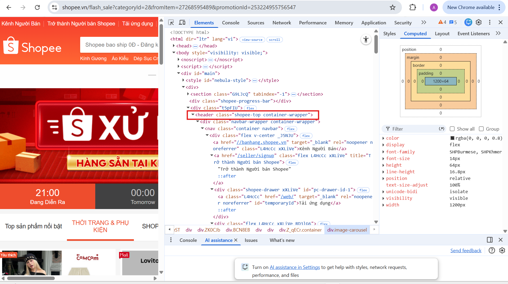
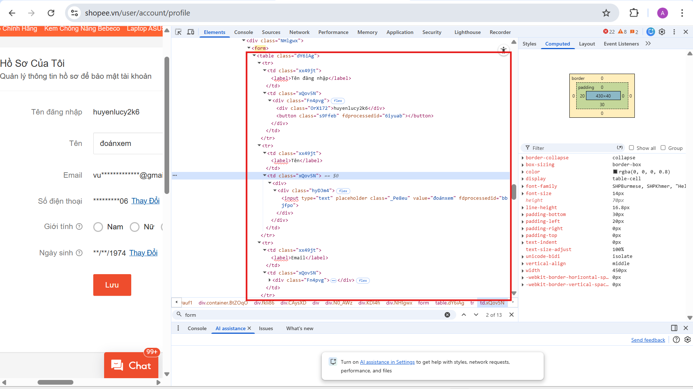
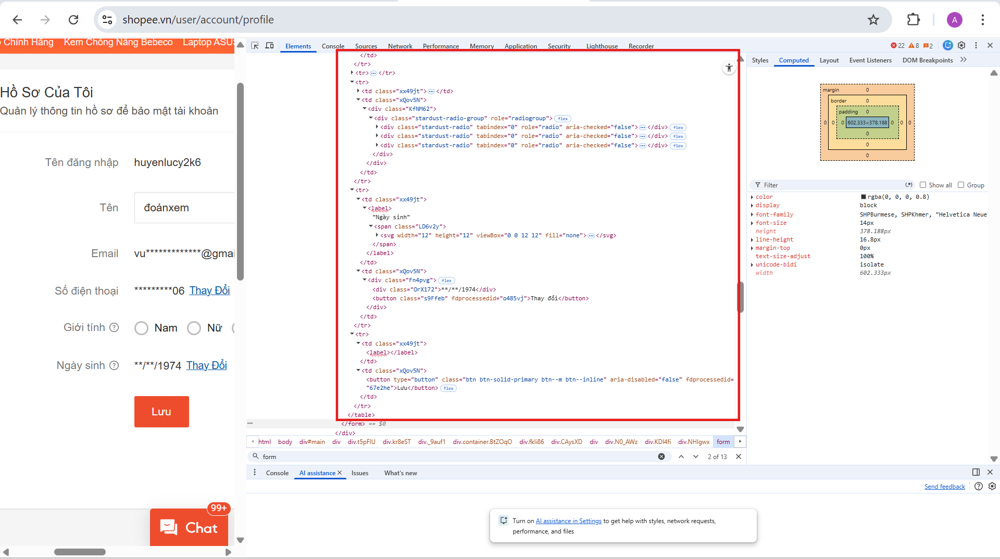
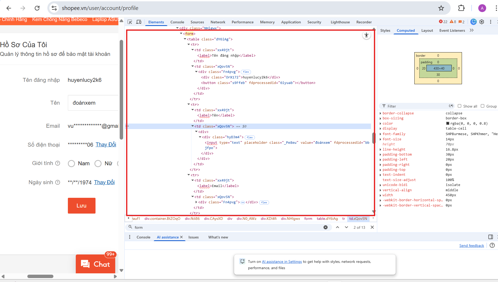

Phần A:  
Câu A1 - HTTP & Browser (tuan_1_html5/01_introduction_html_universe.md + Cuộc Hành Trình 0.3 Giây Xuyên Đại Dương (ý 1) và phần 4 mục 4.3 (ý 2))
1. Khi bạn gõ https://shopee.vn vào trình duyệt và nhấn Enter:
B1: Request của bạn xuất phát từ laptop → đi qua router WiFi nhà trọ
B2: → Qua nhà mạng VNPT → chạy trong tuyến cáp nội địa
B3: → Đến data center của Sea Limited tại Hà Nội
B4: → Server xử lý: "Bạn muốn xem danh sách sản phẩm"
B5: → Response chạy ngược lại: cáp nội địa → VNPT → router → laptop
B6: → Chrome nhận file HTML, CSS, JS → render ra giao diện → bạn thấy danh sách sản phẩm
2. Trong DevTools của Chrome, tab Network cho thấy thông tin:
- Số requests được gửi
- Số dữ liệu thực tế đã được gửi qua đường dây mạng từ server về máy tính của bạn.
- Tổng dung lượng của các tệp tin sau khi trình duyệt đã giải nén và sẵn sàng để render.
- Thời gian trình duyệt đã tải xong và phân giải mã HTML thành cây DOM
- Tổng thời gian để tất cả tài nguyên tải xong hoàn toàn.

    + Status Code của request đầu tiên

    <div>
        
    </div>

    + Tổng thời gian load trang

    <div>
    
    </div>

    + Một request trả về file CSS

    <div>
    
    </div>

Câu A2 - Semantic HTML (tuan_1_html5/00_design_thinking_layout.md + phần 5)
- Lỗi 1: Dùng thẻ `<div>` cho phần header
- Lỗi 2: Dùng thẻ `<div>` cho phần main
- Lỗi 3: Dùng thẻ `<div>` cho phần footer
- Lỗi 4: Thẻ `` chưa có thuộc tính alt  
Sửa lại:
<pre>
&amp;lt;header class=&quot;header&quot;&amp;gt;
    &amp;lt;div class=&quot;logo&quot;&amp;gt;ShopTLU&amp;lt;/div&amp;gt;
    &amp;lt;div class=&quot;menu&quot;&amp;gt;
        &amp;lt;div&amp;gt;&amp;lt;a href=&quot;/&quot;&amp;gt;Trang chủ&amp;lt;/a&amp;gt;&amp;lt;/div&amp;gt;
        &amp;lt;div&amp;gt;&amp;lt;a href=&quot;/products&quot;&amp;gt;Sản phẩm&amp;lt;/a&amp;gt;&amp;lt;/div&amp;gt;
    &amp;lt;/div&amp;gt;
&amp;lt;/header&amp;gt;

&amp;lt;main class=&quot;main&quot;&amp;gt;
    &amp;lt;div class=&quot;product&quot;&amp;gt;
        &amp;lt;div class=&quot;title&quot;&amp;gt;iPhone 16 Pro&amp;lt;/div&amp;gt;
        &amp;lt;div class=&quot;price&quot;&amp;gt;25.990.000đ&amp;lt;/div&amp;gt;
        &amp;lt;div class=&quot;image&quot;&amp;gt;&amp;lt;img src=&quot;iphone.jpg&quot; alt=&quot;ảnh điện thoại&quot;&amp;gt;&amp;lt;/div&amp;gt;
    &amp;lt;/div&amp;gt;
&amp;lt;/main&amp;gt;

&amp;lt;footer class=&quot;footer&quot;&amp;gt;© 2026 ShopTLU&amp;lt;/footer&amp;gt;
</pre>

Câu A3 - Block vs Inline (tuan_1_html5/00_design_thinking_layout.md + phần 6 mục 6.1)  
Kết quả:


Giải thích:
- Thẻ `<div>` là thẻ Block -> mỗi thẻ TỰ XUỐNG DÒNG
- Thẻ `<span>` và `<strong>` là thẻ Inline -> các thẻ NẰM CÙNG DÒNG

Câu A4 - Table (tuan_1_html5/05_tables_hyperlinks.md + phần table)

Thẻ	        | Vai trò	    | Ghi nhớ
| :--- | :--- | :--- | 
`<thead>`	    | Header	    | Tiêu đề cột
`<tbody>`     | Body	        | Dữ liệu chính
`<tfoot>`	    | Footer	    | Tổng kết

Lý do KHÔNG NÊN dùng table để tạo layout trang web:
- Bảng có cấu trúc rất cứng nhắc. Trên màn hình điện thoại, bảng sẽ không thể tự động xếp chồng các cột lên nhau thành hàng dọc được. Điều này dẫn đến việc người dùng phải cuộn ngang để xem hết trang web.
- Cơ chế của Table: Trình duyệt thường phải đợi tải xuống toàn bộ code của bảng rồi mới bắt đầu tính toán kích thước các ô và hiển thị chúng ra màn hình -> Tốc độ tải trang chậm
- Chỉ dùng table cho DATA tabular.

 Phần B:  
Bài B3:
- Lỗi 1: Dòng 4 — Thẻ `<title>` thiếu thẻ `</title>` — Cách sửa thêm thẻ `</title>` vào sau Trang web
- Lỗi 2: Dòng 5 — Giá trị của charset sai — Sửa "utf8" -> "UTF-8"
- Lỗi 3: Dòng 8 — Thiếu thẻ đóng `</h1>` — Thay `<h1>` sau chữ TLU -> `</h1>`
- Lỗi 4: Dòng 12 — Thiếu thẻ đóng `</a>` — Thay `<a>` sau chữ Trang chủ -> `</a>`
- Lỗi 5: Dòng 22 — Thẻ đóng `</b>` nằm ngoài phần tử p — Cho thẻ `</b>` đứng trước thẻ `</p>`
- Lỗi 6: Dòng 40 và 42 — Phần tử main không nên dùng cho nội dung sidebar — Thay phần tử main bằng phần tử aside
- Lỗi 7: Dòng 45 — Thiếu thẻ đóng `</p>` — Thêm `</p>` sau 2026 
- Lỗi 8: Dòng 48 — Thiếu thẻ đóng `</html>` — Thêm `</html>` ở dòng này
- Lỗi 9: Dòng 1 — Lời khai báo bị thiếu html — Thêm html sau DOCTYPE
- Lỗi 10: Dòng 20 — Giá trị của href không đặt trong ngoặc kép và thẻ `` thiếu thộc tính alt — Sửa iphone.jpg -> "iphone.jpg" và thêm thuộc tính alt="Ảnh điện thoại"

Bài B4:
Trong trang shopee.vn có:
1. 
- 3 thẻ semantic HTML5 mà trang đang sử dụng:

+ Thẻ `<header>` nằm bên trong thẻ `<div class="t5PFIU">`, là thành phần con trực tiếp của thẻ div này.  


+ Thẻ `<nav>` nằm nằm bên trong thẻ `<header>`đã nêu ở trên.  


+ Thẻ `<section>` nằm ngay trên thẻ `<div class="shopee-progress-bar">`, là một thành phần con trong khối nội dung chính.  


- Thẻ mà trang đó KHÔNG dùng đúng semantic  
+ Thẻ `<div id="main">` 
2. 



- Table hiển thị nội dung hồ sơ của người dùng
- Không dùng `<thead>`, `<tbody>`
3. 



- Form có:
+ action: "https://shopee.vn/user/account/profile"
+ method: "get"
- Input types:
+ type="text"
+ type="button"
+ role="radio"

Phần C:
Câu C1:
```html
<!DOCTYPE html>
<html lang="vi">
    <head>
        <meta charset="UTF-8">
        <meta name="viewport" content="width=device-width, initial-scale=1.0">
        <title> Chi tiết sản phẩm</title>
    </head>
    <body>
        <!-- Header vì đây là phần đầu trang -->
        <header class="section-header"> 
            <nav> <!-- nav vì đây là phần điều hướng -->
                <ul> <!-- ul vì đây là phần danh sách -->
                    <li><a href="#">Trang chủ</a></li> <!-- li vì đây là phần tử của danh sách -->
                    <li><a href="#">Sản phẩm</a></li>
                    <li><a href="#">Liên hệ</a></li>
                </ul>
            </nav>
        </header>
        <main> <!-- main vì đây là phần nội dung chính của trang -->
            <nav aria-label="breadcrumb"> <!-- nav vì đây là phần điều hướng -->
                <ol class="breadcrumb" style="list-style-type: ' > ' ; display: flex; gap: 20px"> <!-- ol vì đây là phần danh sách có thứ tự -->
                    <li class="breadcrumb-item"><a href="#">Trang chủ</a></li>
                    <li class="breadcrumb-item"><a href="#">Sản phẩm</a></li>
                    <li class="breadcrumb-item active" aria-current="page">Chi tiết sản phẩm</li>
                </ol>
            </nav>
            <figure class="product-pictures"> <!-- figure vì đây là phần chứa hình ảnh sản phẩm -->
                 <!-- img vì đây là phần hình ảnh -->
                
                    
                
                
            </figure>
            <article class="product-infor"> <!-- article vì đây là phần chứa thông tin chi tiết về sản phẩm -->
                <div class="product-name"> <!-- div vì đây là phần chứa tên sản phẩm -->
                    <h1>Tên sản phẩm</h1> <!-- h1 vì đây là phần tiêu đề chính của sản phẩm -->
                </div>
                <div class="product-price"> <!-- div vì đây là phần chứa giá sản phẩm -->
                    <p>Giá: 100,000 VND</p> <!-- p vì đây là phần đoạn văn chứa giá sản phẩm -->
                </div>
                <div class="product-review"> <!-- div vì đây là phần chứa đánh giá sản phẩm -->
                    <p>Đánh giá: ⭐⭐⭐</p> <!-- p vì đây là phần đoạn văn chứa đánh giá sản phẩm -->
                </div>
                <div class="product-description"> <!-- div vì đây là phần chứa mô tả sản phẩm -->
                    <h2>Mô tả sản phẩm</h2> <!-- h2 vì đây là phần tiêu đề phụ của mô tả sản phẩm -->
                    <p>Mô tả sản phẩm sẽ được hiển thị ở đây.</p> <!-- p vì đây là phần đoạn văn chứa mô tả sản phẩm -->
                </div>
            </article>
            <table border="1"> <!-- table vì đây là phần bảng chứa thông số kỹ thuật -->
                <caption>Thông số kỹ thuật</caption> <!-- caption vì đây là phần tiêu đề của bảng -->
                <tr> <!-- tr vì đây là phần hàng của bảng -->
                    <td>Kích thước</td> <!-- td vì đây là phần ô chứa dữ liệu -->
                    <td>30cm x 20cm x 10cm</td>
                </tr>
                <tr>
                    <td>Trọng lượng</td>
                    <td>500g</td>
                </tr>
                <tr>
                    <td>Chất liệu</td>
                    <td>Nhựa cao cấp</td>
                </tr>
            </table> 
            <div class="review-section"> <!-- div vì đây là phần chứa phần đánh giá sản phẩm -->
                <h3>Đánh giá sản phẩm</h3> <!-- h3 vì đây là phần tiêu đề phụ của phần đánh giá sản phẩm -->
                <p>Chưa có đánh giá nào cho sản phẩm này.</p> <!-- p vì đây là phần đoạn văn chứa thông tin đánh giá sản phẩm -->
            </div>
        </main>
        <aside class="sidebar"> <!-- aside vì đây là phần chứa nội dung phụ, không phải là phần chính của trang -->
                <h3>Sản phẩm liên quan</h3> <!-- h3 vì đây là phần tiêu đề phụ của phần sản phẩm liên quan -->
                <ul> <!-- ul vì đây là phần danh sách chứa các sản phẩm liên quan -->
                    <li><a href="#">Sản phẩm A</a></li> <!-- li vì đây là phần tử của danh sách -->
                    <li><a href="#">Sản phẩm B</a></li>
                    <li><a href="#">Sản phẩm C</a></li>
                </ul>
            </aside>
        <footer> <!-- footer vì đây là phần chân trang của trang web -->
            <p>&copy; 2026 Vũ Mai Anh</p> <!-- p vì đây là phần đoạn văn chứa thông tin bản quyền -->
        </footer>
    </body>
</html>
```